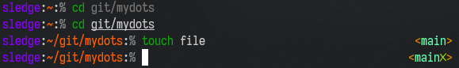
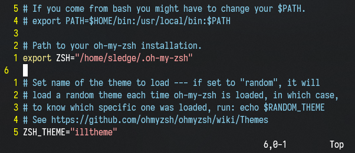

# My epic dotfiles

Making ZSH look like home with my theme and VIM shine like the technetium bar it is.

Requires ZSH, OH-MY-ZSH and VIM.

Installs zsh-autosuggestions and zsh-syntax-highlighting for extra fanciness.

It looks like this:

ZSH prompt:

VIM:

