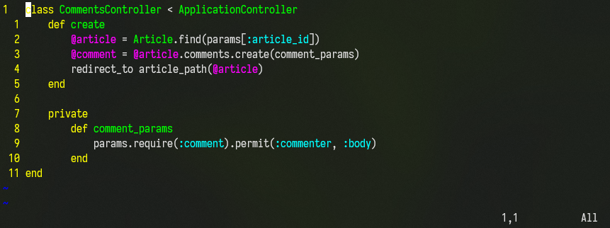

# The illest dotfiles

Making ZSH look like home with my theme and VIM shine like the technetium bar it is.

Requires ZSH, OH-MY-ZSH and VIM.

---

## Installing

```shell
git clone https://www.github.com/technetiumNerd/illdots
illdots/install.sh
```

## NB

Installs zsh-autosuggestions and zsh-syntax-highlighting for extra fanciness. 
Overwrites plugins-line in .zshrc with git and these two if the ^plugins(...)$-line is intact.

---

## It looks like this:

ZSH prompt:


VIM:


